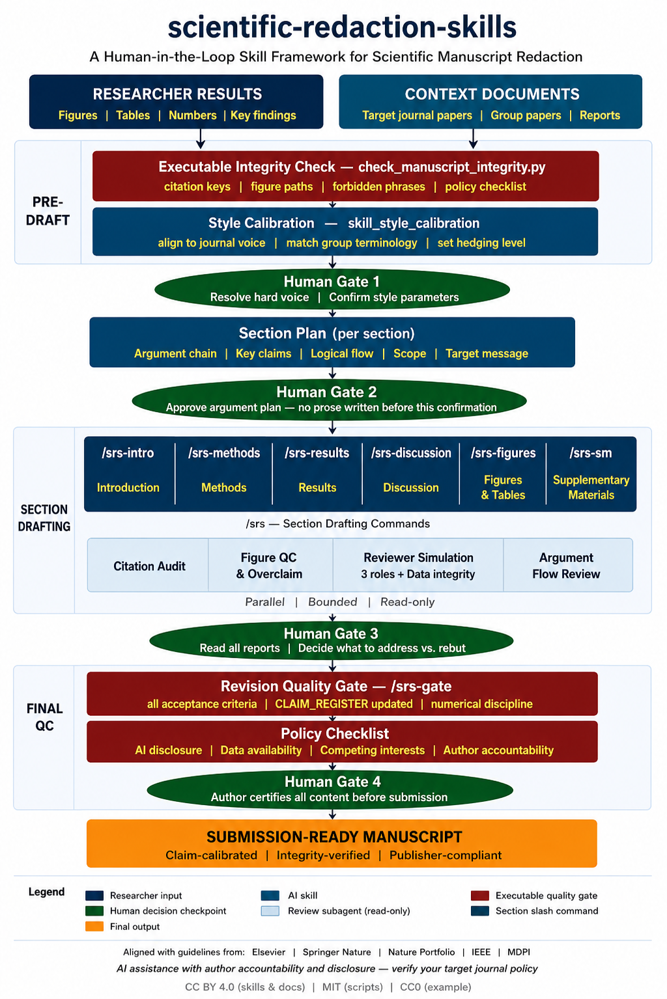
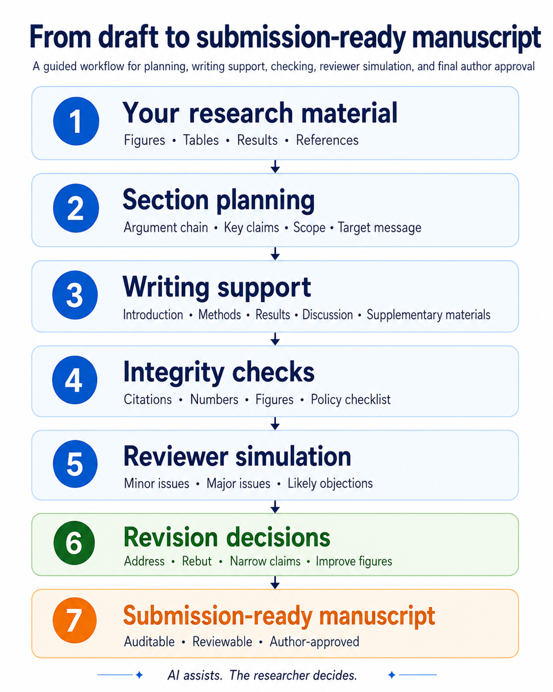
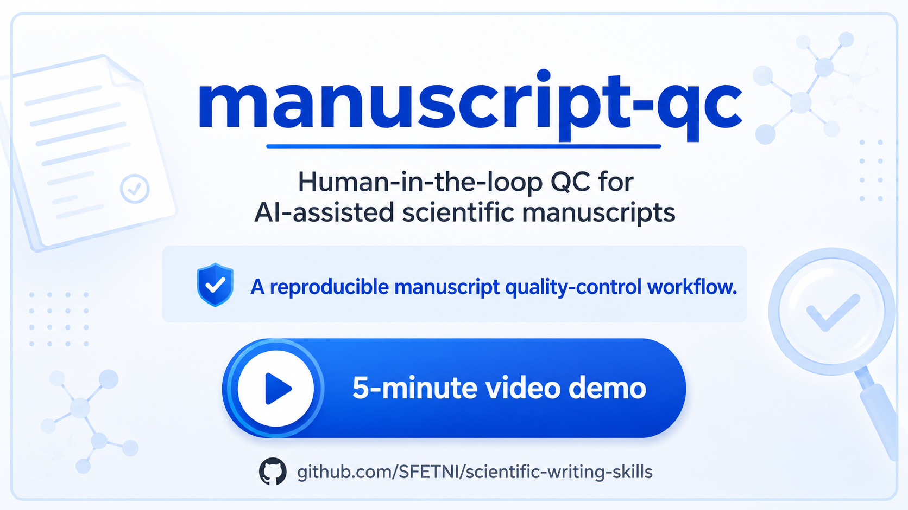

# manuscript-qc
## A Human-in-the-Loop Quality-Control Framework for AI-Assisted Scientific Manuscript Writing and Quality Control using Claude Code and Codex

> **Note on the repository name:** The GitHub repository is named [`scientific-writing-skills`](https://github.com/SFETNI/scientific-writing-skills). The public-facing alias is **manuscript-qc**, used throughout this documentation for clarity.

[](LICENSE)

<p align="center">
  
</p>

<p align="center">
  
</p>

---

## Video demo

A 5-minute walkthrough of manuscript-qc in action: catching four mechanical and two semantic failures in a synthetic manuscript section, stepping through the before/after correction, and completing the final quality gate.

<p align="center">
  <a href="demo/manuscript-qc-5min-demo.mp4">
    
  </a>
</p>

[Watch the 5-minute demo →](demo/manuscript-qc-5min-demo.mp4)

---

## What this is — and what it is not ?

**This framework is not an autonomous system that writes scientific papers from scratch.**

It is a human-in-the-loop quality-control and redaction framework for researchers who already have scientific material: results, figures, tables, references, draft sections, or a detailed section plan. Given that material, the framework helps draft, revise, restructure, and review manuscript sections while improving clarity, claim discipline, citation reliability, figure/table integration, and reviewer readiness.

The framework does not invent findings, fabricate references, define the scientific contribution, or accept text on behalf of the author. **AI assists; the researcher decides**.

Its purpose is to help turn existing research into a publication-quality manuscript without introducing overclaims, citation errors, AI-writing artifacts, or integrity failures.

The science remains yours. The framework makes AI-assisted manuscript preparation **auditable, reviewable, and accountable**.

> *"These tools must never be used as a substitute for human critical thinking, expertise and evaluation. Ultimately, authors are responsible and accountable for the contents of their work."*
> — Elsevier, [AI and AI-Assisted Technologies in Writing](https://www.elsevier.com/about/policies-and-standards/the-use-of-generative-ai-and-ai-assisted-technologies-in-writing-for-elsevier) (updated September 2025)

That sentence is the design brief for every skill in this framework.

---

### Built from practical manuscript experience
This framework is not a theoretical prompt collection. It is built from practical experience with scientific manuscript drafting, revision, peer-review response, invited review, citation checking, figure and table quality control, and journal-oriented writing workflows.

The skills encode recurring problems that appear in real manuscript preparation: unsupported claims, decorative citation clusters, overconfident AI phrasing, weak paragraph continuity, unclear figure captions, inconsistent numerical reporting, and tables that interpret results instead of reporting them. The goal is to turn those practical lessons into reusable quality-control procedures that other researchers can inspect, adapt, and improve.

## The problem this addresses

Informal, uncontrolled AI use in manuscript preparation is degrading scientific literature quality — not only through citation fabrication, but through a broader erosion of writing precision, scientific specificity, and textual originality. The evidence is recent and specific:

**On citation integrity:**
- Fabricated citations in the biomedical literature increased **six-fold** between 2023 and 2025, reaching 1 in 277 papers in early 2026, according to a Lancet-cited analysis ([STAT News, 2026](https://www.statnews.com/2026/05/07/lancet-study-finds-steep-rise-fraudulent-citations-academic-papers/)).
- A 2026 investigation of NeurIPS 2025 accepted papers found more than 100 AI-hallucinated references that passed peer review — in some cases, the AI blended author names, fabricated titles, or subtly paraphrased real papers into non-existent ones ([arXiv, 2026](https://arxiv.org/html/2602.05930v1)).
- A *Nature* analysis found that tens of thousands of 2025 publications may contain invalid AI-generated references ([*Nature*, 2026](https://www.nature.com/articles/d41586-026-00969-z)).
- A study of GPT-4o–generated citations in mental health research found that **56 % contained errors**, with one in five being fully hallucinated ([StudyFinds, 2025](https://studyfinds.org/chatgpts-hallucination-problem-fabricated-references/)).

**On writing quality and scientific precision:**
- A *Science Advances* study (2025) found that at least 13.5 % of 2024 biomedical abstracts show evidence of LLM processing — and that AI-modified text shifts toward vaguer, more formulaic phrasing, with style-affecting adjectives replacing precise scientific vocabulary ([Liu et al., *Science Advances*, 2025](https://www.science.org/doi/10.1126/sciadv.adt3813)).
- Writing with LLMs produces a statistically significant **reduction in lexical and content diversity**: different authors' texts converge toward the same vocabulary and sentence structures, reducing the breadth of scientific discourse ([Padmakumar & He, ICLR, 2024](https://proceedings.iclr.cc/paper_files/paper/2024/file/02dec8877fb7c6aa9a79f81661baca7c-Paper-Conference.pdf)).
- Human reviewers consistently identify AI-assisted abstracts as **superficial and vague** — less specific about methods, less precise about conditions, and more reliant on hedging qualifiers that soften without clarifying ([Nature npj Digital Medicine, 2023](https://www.nature.com/articles/s41746-023-00819-6)).

The root cause is not that AI tools are untrustworthy. It is that researchers are using them **without structured quality control**. This framework addresses that gap by using AI itself under strict human oversight — enforcing the discipline that informal use bypasses.

Three recurring failure modes drive the design:

**Citation fabrication.** AI language models hallucinate references — generating plausible-sounding but non-existent papers, fabricated DOIs, and blended author names. The only reliable defence is human review of every citation against its full text, at a tier above "the key exists in the .bib file." This framework implements a four-tier citation verification ladder enforced by dedicated skills:

| Tier | What it means | Who confirms |
|---|---|---|
| `KEY_EXISTS` | Key is present in the `.bib` file | Integrity checker script |
| `METADATA_VERIFIED` | Author, year, title, venue are complete and consistent | Script + agent |
| `ABSTRACT_RELEVANT` | Abstract confirms the paper is relevant to the claim | Agent (human reviews) |
| `FULL_TEXT_SUPPORTS_CLAIM` | Full text was read and confirms the specific claim | **Human only** |

Skills may never collapse these tiers into a single "verified" label. Every citation that has not been read in full must remain open for human confirmation before the section is accepted.

**Claim inflation.** AI models generate assertive, confident prose. Unchecked, AI-assisted text overstates results, universalises findings, and understates limitations. Every quantitative claim in this framework must be registered before it appears in the manuscript; every interpretive claim must carry an evidence status label.

**Context loss.** AI agents do not know which results are fixed, which interpretations are provisional, or what the intended scope of the contribution is. This context lives in the researcher's head and registered files. Without human review, AI-generated text drifts beyond the intended scope. This framework encodes that context explicitly in `AUTHOR_CONTEXT.md`, `NUMERICAL_REGISTRY.md`, and `SECTION_PLAN.md` — files the agent reads before every task.

---

## Who this is for

- **Early-career researchers** who are developing manuscript redaction skills and need structured guidance on what publication-quality writing looks like: claim discipline, citation placement, figure legibility, argument flow, and limitation acknowledgement.
- **Corresponding authors** managing multi-author manuscripts with inconsistent section quality, who need a reproducible QC workflow that can be applied uniformly across sections and revisions.
- **Any researcher** who uses AI assistance for writing and wants to do so in a controlled, auditable, and publisher-compliant way — rather than informally accepting AI output and hoping peer review catches the problems.

The goal is not to produce papers faster. The goal is to produce **better, more honest, more verifiable manuscripts** — and to make the quality-control process visible, reproducible, and defensible.

---

## How it works: human-in-the-loop gates

Every skill in this framework enforces one principle: **AI assists, humans decide.**

The agent produces drafts, reports, warnings, and checklists. The researcher reviews every output, resolves every flagged item, and certifies every accepted section. No content is automatically committed to the manuscript.

There are **15 mandatory human checkpoints** across five phases:

| Phase | Human decision required |
|---|---|
| **Pre-draft** | Integrity check cleared; style calibration approved |
| **Section plan** | Argument chain approved for each section — no prose written before this |
| **Drafting** | Draft reviewed; claim-source map resolved; quality gate passed |
| **Figures & SM** | Figure QC approved; captions confirmed; SM scope approved |
| **Review** | Reviewer simulation report read; address/rebut decisions recorded |
| **Final QC + Submission** | Policy checklist complete; author certifies all content |

All 15 checkpoints are treated as blocking workflow gates. Silence is not consent; the agent must stop and request explicit human confirmation before accepting or applying material changes.

Full rationale and checkpoint table: [`docs/HUMAN_IN_THE_LOOP.md`](docs/HUMAN_IN_THE_LOOP.md)

---

## What's inside

### 24 skill files across 5 categories

| Category | Skills | What they do |
|---|---|---|
| `writing/` | 8 | Section drafting, prose quality, claim calibration, benchmark positioning, Methods, Results, SM, quality gate |
| `integrity/` | 4 | Claim–evidence verification, citation audit (4-tier ladder), reference verification, literature research |
| `figures/` | 4 | Figure QC, caption writing, table design, visual consistency |
| `review/` | 3 | Reviewer simulation (4 roles), argument flow review, editorial decision estimation |
| `workflow/` | 4 | Style calibration, task protocol, human checkpoints manifest, process trace |

Every skill file has the same structure: **Mandate · Required inputs · Acceptance criteria · HiTL checkpoint · Fail conditions.**

### 10 Claude Code slash commands

| Command | What it does |
|---|---|
| `/srs-check` | Run the executable integrity checker (Step 0a) |
| `/srs-calibrate` | Style calibration from `context/` papers (Step 0c) |
| `/srs-intro` | Introduction: benchmark positioning → drafting → claim calibration |
| `/srs-methods` | Methods: drafting → claim evidence verification |
| `/srs-results` | Results: argument plan approval → drafting → figure QC → claim calibration |
| `/srs-discussion` | Discussion: argument flow → drafting → claim calibration → reviewer perspective |
| `/srs-figures` | All figures and tables: QC → captions → visual consistency → table design |
| `/srs-sm` | Supplementary Materials: scope approval → drafting → figure QC |
| `/srs-review` | Full-manuscript 4-role reviewer simulation (parallel subagents) |
| `/srs-gate` | Revision quality gate + policy checklist |

### Executable integrity checker

`scripts/check_manuscript_integrity.py` — Python standard library, no dependencies. Checks:
1. Citation keys: all `\cite{}` keys exist in the `.bib` file (`KEY_EXISTS` tier)
2. Figure paths: all `\includegraphics{}` paths resolve to real files
3. Banned phrases: AI-writing artifacts (configurable list)
4. Numerical discipline: cross-reference all decimal values against `NUMERICAL_REGISTRY.md`
5. Policy checklist: AI disclosure, data availability, competing interests, author contributions

> **Note on citation verification:** The checker reaches the `KEY_EXISTS` tier only — it confirms that citation keys exist in the `.bib` file. Advancing to `METADATA_VERIFIED`, `ABSTRACT_RELEVANT`, and `FULL_TEXT_SUPPORTS_CLAIM` requires skill-based review via `/srs-check` and human reading. See the four-tier ladder in the problem section above.

### Six bounded read-only subagents

Parallel review agents for citation audit, figure QC, overclaim detection, reviewer simulation (4 roles), argument flow, and style calibration. Each is bounded: read-only, no web access, returns a report to the main agent for human review.

### Publisher policy reference

`agent_context/JOURNAL_POLICY.md` — per-publisher lookup table for AI writing policies: Elsevier, Springer Nature, Nature Portfolio, IEEE, MDPI, arXiv, ICMJE. Includes an AI disclosure template.

### Demonstration worked example

`example/` - a concrete compressive-strength ridge-regression worked example (CC0). The current artifacts use deterministic fallback data labelled `DETERMINISTIC_FALLBACK_NOT_UCI`, not verified UCI observations. The example demonstrates generated figures/tables, real citation metadata, filled project context, handoff tracking, and review reports; see `example/README.md` for the current role-status table and remaining registry/QC gaps.

---

## Quick install

**Claude Code slash commands (recommended):**
```bash
git clone https://github.com/SFETNI/scientific-writing-skills
cd your-manuscript-project
mkdir -p .claude
ln -s /path/to/scientific-writing-skills/.claude/commands .claude/commands
```

The `/srs-*` commands are immediately available in any Claude Code session from your manuscript directory.

**Manual copy (no symlink):**
```bash
cp -r scientific-writing-skills/.claude/commands  your-project/.claude/
cp -r scientific-writing-skills/skills            your-project/
cp -r scientific-writing-skills/templates         your-project/docs/templates/
cp -r scientific-writing-skills/agent_context     your-project/
cp    scientific-writing-skills/CLAUDE.md         your-project/
```

Detailed setup including Codex configuration: [`docs/SETUP.md`](docs/SETUP.md)

---

## 5-minute launch demo

A self-contained demo showing manuscript-qc catching and correcting common AI-assisted manuscript risks.

**What it shows:**
- Python checker catching four mechanical failures (missing citation key, missing figure file, banned phrase, unregistered value)
- Agent skill layer catching two semantic failures (overclaim, vague figure caption)
- Before/after paragraph comparison with full change rationale
- Final `/srs-gate` checklist requiring explicit researcher sign-off

**Video:** [`demo/manuscript-qc-5min-demo.mp4`](demo/manuscript-qc-5min-demo.mp4)

---

## Five-minute example

```bash
# Run the integrity checker on the demonstration manuscript
python scripts/check_manuscript_integrity.py \
  --main-tex example/manuscript/main.tex \
  --bib example/manuscript/references/example_references.bib \
  --registry example/NUMERICAL_REGISTRY.md

# Compare with the pre-generated output:
cat example/outputs/example_integrity_check.txt
```

Then open Claude Code in the `example/` directory:
```
/srs-check
/srs-intro
```

---

## Adapting to your project (10-step onboarding)

1. Copy `templates/` into your manuscript project
2. Fill `AUTHOR_CONTEXT.md`: target journal, `RESULT_FLEXIBILITY` (`LOCKED` / `FIGURES_IMPROVABLE` / `MINOR_ANALYSIS_ALLOWED`), `TARGET_JOURNAL_FAMILY`
3. Fill `STYLE_GUIDE.md`: preferred terms, forbidden terms, hedging level
4. Fill `NUMERICAL_REGISTRY.md`: every accepted quantitative claim with its source artifact
5. Add `.md` extracts of 3–5 target journal papers to `context/target_journal/`
6. Run `/srs-check` — resolve all hard errors before any drafting
7. Run `/srs-calibrate` — approve the style calibration report (Step 0c)
8. For each section: fill `SECTION_PLAN.md` → get human approval → run `/srs-<section>`
9. Run `/srs-review` when all sections are accepted
10. Run `/srs-gate` for the final pre-submission check

Full walkthrough with examples: [`docs/WORKFLOW_GUIDE.md`](docs/WORKFLOW_GUIDE.md)

---

## Repository structure

```
scientific-writing-skills/          (public alias: manuscript-qc)
│
├── CLAUDE.md                       ← agent startup instructions (read this first)
├── CODEX.md                        ← Codex/GPT agent orientation
│
├── .claude/commands/               ← 10 /srs-* Claude Code slash commands
│
├── skills/                         ← 24 skill files
│   ├── writing/                    ← drafting, prose quality, claim calibration, QC gate
│   ├── integrity/                  ← citation audit, evidence verification, reference check
│   ├── figures/                    ← figure QC, captions, table design, visual consistency
│   ├── review/                     ← reviewer simulation, argument flow, editorial estimate
│   └── workflow/                   ← style calibration, task protocol, process trace
│
├── templates/                      ← user-fill project files
│   ├── AUTHOR_CONTEXT.md           ← target journal, RESULT_FLEXIBILITY, file paths
│   ├── NUMERICAL_REGISTRY.md       ← all accepted quantitative claims
│   ├── STYLE_GUIDE.md              ← preferred terms, forbidden terms, hedging
│   ├── SECTION_PLAN.md             ← argument chain per section
│   ├── CLAIM_REGISTER.md           ← claim–evidence map
│   ├── AGENT_HANDOFF.md            ← session state and checkpoint log
│   └── subagents/                  ← 6 bounded read-only subagent templates
│
├── agent_context/                  ← ready-to-use agent context files
│   ├── ANTI_AI_WRITING_STYLE.md    ← forbidden phrases, AI artifact patterns
│   ├── JOURNAL_POLICY.md           ← per-publisher AI policy reference table
│   └── MULTI_AGENT_ROLES.md        ← Claude / Codex / subagent role separation
│
├── scripts/
│   └── check_manuscript_integrity.py  ← executable integrity checker (stdlib only)
│
├── context/                        ← place your reference paper .md extracts here
│   ├── target_journal/
│   ├── group_papers/
│   └── reference_papers/
│
├── demo/
│   └── manuscript-qc-5min-demo.mp4 ← demo video (Git LFS)
│
├── example/                        ← concrete worked example with deterministic fallback data (CC0)
│
└── docs/
    ├── graphical_abstract.png      ← visual overview of the full workflow
    ├── manuscript_preparation_workflow.png ← manuscript preparation workflow figure
    ├── demo.png                    ← demo video thumbnail
    ├── ARCHITECTURE.md             ← pipeline diagram, skill–stage matrix, agent roles
    ├── HUMAN_IN_THE_LOOP.md        ← HiTL rationale and all 15 mandatory checkpoints
    ├── SETUP.md                    ← installation for Claude Code, Codex, multi-agent
    └── WORKFLOW_GUIDE.md           ← 10-step onboarding walkthrough
```

---

## Publisher alignment and AI ethics

This framework is designed to support compliance with publisher guidelines on AI-assisted writing. Major publishers generally permit AI assistance for language quality, prose organisation, and structural review — subject to disclosure requirements, with authors retaining full scientific responsibility. Requirements vary by journal and continue to evolve.

The framework encodes these principles structurally:

| Design objective | How this framework addresses it |
|---|---|
| Author retains responsibility for all content | Every skill output requires explicit human approval; no content is auto-committed |
| AI use must be disclosed | Policy checklist in `/srs-gate` includes an AI disclosure item; a disclosure template is in `JOURNAL_POLICY.md` |
| AI cannot be listed as author | The framework is explicitly a tool for human authors, not an authorship replacement |
| No AI-generated scientific evidence | The framework does not invent data, results, or figures. It may help review, restyle, or rebuild figures only from user-provided accepted data or existing outputs.

Always verify the current AI policy of your target journal before submission. Policies change. The per-publisher summary in `agent_context/JOURNAL_POLICY.md` is a starting reference, not a compliance guarantee.

Publishers referenced: [Elsevier](https://www.elsevier.com/about/policies-and-standards/the-use-of-generative-ai-and-ai-assisted-technologies-in-writing-for-elsevier) · [Springer Nature](https://www.springernature.com/gp/policies/editorial-policies) · [Nature Portfolio](https://link.springer.com/brands/springer/journal-policies) · [IEEE author guidelines](https://ieeeauthorcenter.ieee.org) · [MDPI author guidelines](https://www.mdpi.com/authors) · [ICMJE Recommendations](https://www.icmje.org)

> Per-publisher policy summary and AI disclosure template: [`agent_context/JOURNAL_POLICY.md`](agent_context/JOURNAL_POLICY.md)

---

## Important limitations

**The framework cannot guarantee manuscript correctness.** It reduces risk through structured review at every stage, but cannot substitute for the author's scientific judgment.

Specific limitations every user must understand:

- **Full-text citation verification is the author's responsibility.** The framework can advance citations to `ABSTRACT_RELEVANT` tier automatically. Reaching `FULL_TEXT_SUPPORTS_CLAIM` requires the author to read the full text of the paper. An agent that has not read the full text cannot confirm that a paper supports a specific claim — and must not declare that it does.
- **Every generated edit must be human-reviewed.** No skill output is accepted automatically. If you accept agent-drafted prose without reading it critically, you are responsible for any errors, overclaims, or fabricated content it contains.
- **The integrity checker is a first-pass filter, not a verification system.** It checks that citation keys exist in the `.bib` file and that decimal values appear in the registry. It does not verify that cited papers exist, that DOIs resolve, or that references actually support the claims attributed to them. Those verifications require human effort.
- **The framework is field-agnostic and cannot judge field-specific norms.** Whether a hedging level is appropriate, whether a limitation is material, and whether a claim is in scope for a given journal are judgments that require domain expertise — which this framework does not have.
- **Publisher policy summaries are non-authoritative.** `agent_context/JOURNAL_POLICY.md` is a convenience reference compiled at a point in time. Journal-specific requirements override everything in that file. Always check the target journal's current author instructions.

---

## What this framework does not do

These are explicit non-goals:

- **Does not generate scientific findings.** Every claim, number, and finding must come from the researcher's own results. The framework enforces this via `NUMERICAL_REGISTRY.md` — any value not registered cannot appear in the manuscript.
- **Does not search the literature autonomously.** The `skill_literature_research` skill requires explicit human authorization before any web search.
- **Does not accept AI output automatically.** Every skill output waits for human review and confirmation.
- **Does not produce publisher-submission-ready PDFs.** LaTeX compilation and format conversion are Codex tasks, documented in `CODEX.md`.
- **Does not cover literature discovery or study design.** These are covered by [`academic-research-skills`](https://github.com/Imbad0202/academic-research-skills) — a complementary framework for the earlier pipeline stages.

---

## Related projects

**[academic-research-skills (ARS)](https://github.com/Imbad0202/academic-research-skills)** — comprehensive full-pipeline research assistant: literature discovery, writing, and peer review for exploratory research. ARS is the most complete public Claude Code framework available for that scope. The two projects are complementary: use ARS when starting a project from the literature; use manuscript-qc when your results are ready and you need to finish the paper at publication quality.

**General AI writing assistants** (Writefull, Grammarly Academic, etc.) — provide grammar and style suggestions, but do not enforce claim calibration, numerical registries, four-tier citation verification, executable integrity checks, or human-in-the-loop gates. This framework fills that gap for researchers who need structured, auditable QC rather than passive style suggestions.

---

## License

| Component | License |
|---|---|
| Scripts (`scripts/`) | [MIT](LICENSE) |
| Skills, templates, documentation | [CC BY 4.0](LICENSE) |
| Demonstration example (`example/`) | [CC0 — Public Domain](LICENSE) |

CC BY 4.0 was chosen over CC BY-NC to avoid restricting use by researchers at industry institutions or those under open-access mandates.

---

## Contributing

See [`CONTRIBUTING.md`](CONTRIBUTING.md) for how to add new skills, report broken skills, request new features, or contribute to the phrase ban list.

The core contribution standard: every skill file must have all five required sections (Mandate, Required inputs, Acceptance criteria, HiTL checkpoint, Fail conditions), and every example file must clearly label demonstration or fallback content so it cannot be mistaken for validated manuscript data.
